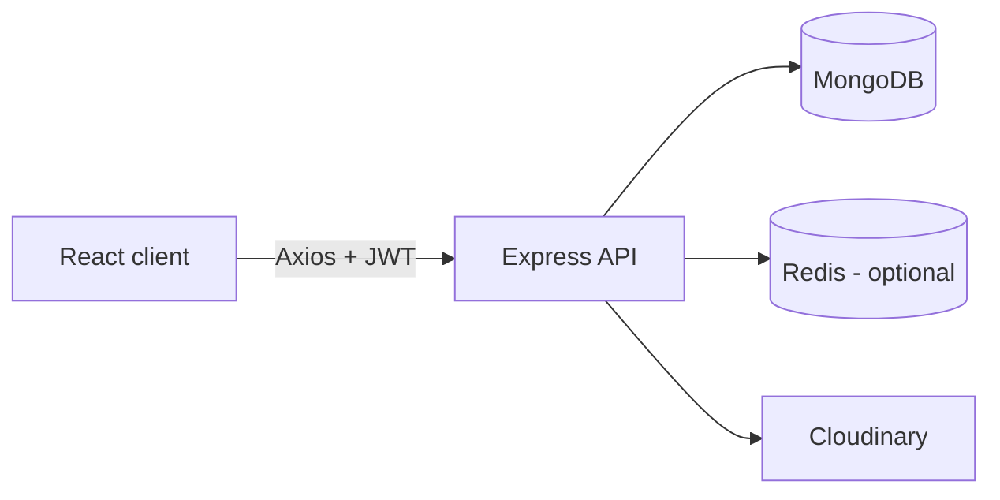

<div align="center">

# Stockify

**Inventory management for products, stock movements, categories, and teams.**

[](https://nodejs.org/)
[](https://react.dev/)
[](https://expressjs.com/)
[](https://www.mongodb.com/)

[Getting Started](#getting-started) · [Features](#features) · [API](#api) · [Production](#production)

</div>

---

Stockify is a MERN inventory workspace for tracking products, stock IN/OUT,
low-stock conditions, transaction history, and role-based user access.

It is designed for small operational teams that need a focused inventory
system without public account registration. Administrators create and manage
all user accounts from inside the application.

## Features

- Inventory dashboard with stock totals, valuation, and low-stock alerts
- Product CRUD with unique SKU and optional Cloudinary image upload
- Stock IN and OUT operations with insufficient-stock protection
- Search, category, stock-status, price, and quantity filters
- Transaction history with product, operator, date, type, and quantity filters
- Admin-only category and user management
- JWT authentication with `admin` and `staff` roles
- Redis caching and logout token blacklist when Redis is available
- OpenAPI specification and built-in Swagger UI
- Reusable database seeder with demo data

## Stack

| Area | Technology |
| --- | --- |
| Frontend | React 19, Vite 8, React Router, Axios |
| Backend | Node.js, Express 5 |
| Database | MongoDB, Mongoose |
| Authentication | JWT, bcryptjs |
| Cache | Redis, optional |
| Media | Multer, Cloudinary |
| API documentation | OpenAPI 3.0, Swagger UI |

Vite 8 requires Node.js `^20.19.0` or `>=22.12.0`.

## Architecture



The frontend stores the authenticated session locally and sends the JWT using:

```http
Authorization: Bearer <token>
```

Protected backend routes verify the token before applying role checks and
calling MongoDB, Redis, or Cloudinary.

## Getting Started

### Prerequisites

- Node.js `20.19+` or `22.12+`
- npm
- MongoDB
- Redis, optional
- Cloudinary account, optional unless product images are uploaded

### 1. Clone

```bash
git clone https://github.com/AhmadRizkiadi/Stockify.git
cd Stockify
```

### 2. Configure and run the backend

```bash
cd backend
npm install
```

Create `backend/.env`:

```env
PORT=5000
MONGO_URI=mongodb://127.0.0.1:27017/stockify
JWT_SECRET=replace_with_a_long_random_secret

# Optional
REDIS_URL=redis://127.0.0.1:6379

# Required for image upload
CLOUDINARY_CLOUD_NAME=
CLOUDINARY_API_KEY=
CLOUDINARY_API_SECRET=
```

Seed development data and start the API:

```bash
npm run seed
npm run dev
```

The API is available at `http://localhost:5000`.

### 3. Configure and run the frontend

Open another terminal:

```bash
cd frontend
npm install
npm run dev
```

The frontend uses `http://localhost:5000/api` by default. To use another API:

```env
# frontend/.env
VITE_API_URL=http://localhost:5000/api
```

Open `http://localhost:5173`.

### 4. Sign in

The development seeder creates:

| Role | Email | Password |
| --- | --- | --- |
| Admin | `admin@stockify.local` | `stockify123` |
| Staff | `staff@stockify.local` | `stockify123` |

These credentials are for local development only.

## Access Control

| Capability | Staff | Admin |
| --- | :---: | :---: |
| Dashboard | Yes | Yes |
| Product CRUD | Yes | Yes |
| Stock IN/OUT | Yes | Yes |
| Transaction history | Yes | Yes |
| View categories | Yes | Yes |
| Category management | No | Yes |
| User management | No | Yes |

Public registration is disabled. New accounts are created by an Admin from
`/users` or through `POST /api/users`.

## Application Routes

| Route | Access | Purpose |
| --- | --- | --- |
| `/login` | Public | Sign in |
| `/dashboard` | Authenticated | Inventory overview |
| `/products` | Authenticated | Product list and filters |
| `/products/create` | Authenticated | Create product |
| `/products/:id/edit` | Authenticated | Edit product |
| `/categories` | Authenticated | Category list and admin actions |
| `/stock-in` | Authenticated | Record incoming stock |
| `/stock-out` | Authenticated | Record outgoing stock |
| `/transactions` | Authenticated | Transaction history and filters |
| `/users` | Admin | Create and manage users |

Legacy registration routes redirect to login. The old `/inventory/*` route
redirects to the dashboard.

## API

Development base URL:

```text
http://localhost:5000/api
```

### Core endpoints

| Resource | Endpoints |
| --- | --- |
| Authentication | `POST /auth/login`, `POST /auth/logout`, `GET /auth/profile` |
| Products | `GET/POST /products`, `GET/PUT/DELETE /products/:id` |
| Categories | `GET/POST /categories`, `PUT/DELETE /categories/:id` |
| Stock | `POST /stock/in`, `POST /stock/out` |
| Transactions | `GET /transactions` |
| Dashboard | `GET /dashboard/summary` |
| Users | `GET/POST /users`, `PUT/DELETE /users/:id` |

Category mutations and all user endpoints require the Admin role.

Product create/update accepts JSON or `multipart/form-data`. The image field is
named `image`; accepted formats are JPEG, PNG, JPG, and WEBP with a 2 MB limit.

### Filters

Products support:

```text
search, category, stockStatus, lowStock, minStock, maxStock,
minPrice, maxPrice, sort
```

Example:

```http
GET /api/products?search=printer&category=Electronics&stockStatus=low&sort=priceAsc
```

Transactions support:

```text
type, product, search, dateFrom, dateTo, quantityMin, quantityMax, sort
```

Example:

```http
GET /api/transactions?type=OUT&dateFrom=2026-06-01&dateTo=2026-06-30
```

For request schemas, response examples, and status codes, use the generated API
documentation:

- Swagger UI: `http://localhost:5000/api-docs`
- OpenAPI JSON: `http://localhost:5000/api-docs.json`
- Health check: `http://localhost:5000/`
- Redis check: `http://localhost:5000/api/test-redis`

## Database Seeder

Run the idempotent development seeder:

```bash
cd backend
npm run seed
```

Reset all users, products, categories, and transactions before reseeding:

```bash
npm run seed:reset
```

> `seed:reset` is destructive. Never run it against a production database.

## Project Structure

```text
stockify-mern/
|-- backend/
|   |-- server.js
|   |-- package.json
|   `-- src/
|       |-- config/
|       |-- controllers/
|       |-- docs/
|       |-- middleware/
|       |-- models/
|       |-- routes/
|       |-- seeders/
|       `-- utils/
|-- frontend/
|   |-- package.json
|   |-- vite.config.js
|   `-- src/
|       |-- components/
|       |-- context/
|       |-- hooks/
|       |-- layouts/
|       |-- pages/
|       |-- utils/
|       |-- App.jsx
|       `-- main.jsx
`-- README.md
```

## Development

### Backend commands

```bash
npm run dev
npm start
npm run seed
npm run seed:reset
```

### Frontend commands

```bash
npm run dev
npm run lint
npm run build
npm run preview
```

Before submitting changes:

```bash
cd frontend
npm run lint
npm run build
```

The backend does not currently include an automated test suite. Verify login,
role restrictions, product mutations, stock movements, filters, and user
creation manually when changing those flows.

## Production

Before deploying:

1. Use a production MongoDB deployment with authentication and network rules.
2. Generate a long random `JWT_SECRET`.
3. Set `VITE_API_URL` to the HTTPS backend URL.
4. Restrict backend CORS to trusted frontend origins.
5. Use persistent Redis if logout blacklist behavior must survive restarts.
6. Configure Cloudinary if image uploads are enabled.
7. Serve the API and frontend over HTTPS.
8. Configure SPA fallback to `index.html` for frontend routes.
9. Change or remove all seeded credentials.
10. Do not run `npm run seed:reset`.

### Current readiness

The application works as a complete development project, but additional
hardening is recommended before handling production data:

- automated backend and frontend tests;
- CI/CD checks;
- restricted CORS configuration;
- structured logs, monitoring, and audit trails;
- database backup and restore procedures;
- stronger session storage such as secure `HttpOnly` cookies where required.

## Troubleshooting

### `MONGO_URI is required`

Create `backend/.env` and provide a valid MongoDB connection string.

### Login fails after setup

Run `npm run seed` inside `backend`, then confirm that the backend and seeder use
the same `MONGO_URI`.

### Redis connection fails

Redis is optional. Remove `REDIS_URL` when it is not used, or confirm that the
configured Redis service is reachable.

### Product image upload fails

Check the Cloudinary variables. Files must be JPEG, PNG, JPG, or WEBP and no
larger than 2 MB.

### Frontend cannot reach the API

Check that the backend is running, verify `VITE_API_URL`, and restart Vite after
changing frontend environment variables.

### Direct frontend URLs return `404`

Configure the production web server to rewrite unknown routes to `index.html`.

## Roadmap

- Automated tests and CI
- Pagination for products and transactions
- Audit log for privileged actions
- CSV/XLSX report export
- Docker-based local and production setup
- Structured logging and monitoring

## Repository

[github.com/AhmadRizkiadi/Stockify](https://github.com/AhmadRizkiadi/Stockify)
